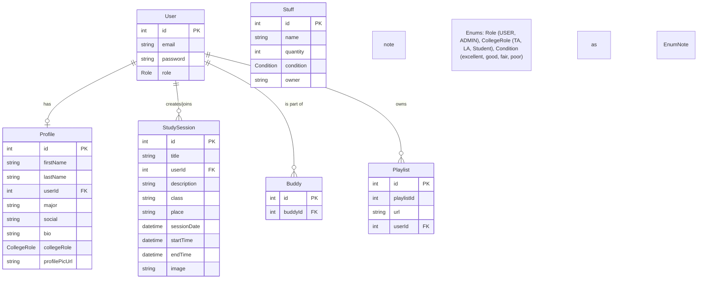

```mermaid
erDiagram
    User ||--O| Profile : "has"
    User ||--O{ StudySession : "creates/joins"
    User ||--O{ Buddy : "is part of"
    User ||--O{ Playlist : "owns"
    User {
        int id PK
        string email
        string password
        Role role
    }

    Profile {
        int id PK
        string firstName
        string lastName
        int userId FK
        string major
        string social
        string bio
        CollegeRole collegeRole
        string profilePicUrl
    }

    StudySession {
        int id PK
        string title
        int userId FK
        string description
        string class
        string place
        datetime sessionDate
        datetime startTime
        datetime endTime
        string image
    }

    Buddy {
        int id PK
        int buddyId FK
    }

    Playlist {
        int id PK
        int playlistId
        string url
        int userId FK
    }

    Stuff {
        int id PK
        string name
        int quantity
        Condition condition
        string owner
    }

    note "Enums: Role (USER, ADMIN), CollegeRole (TA, LA, Student), Condition (excellent, good, fair, poor)" as EnumNote
```
