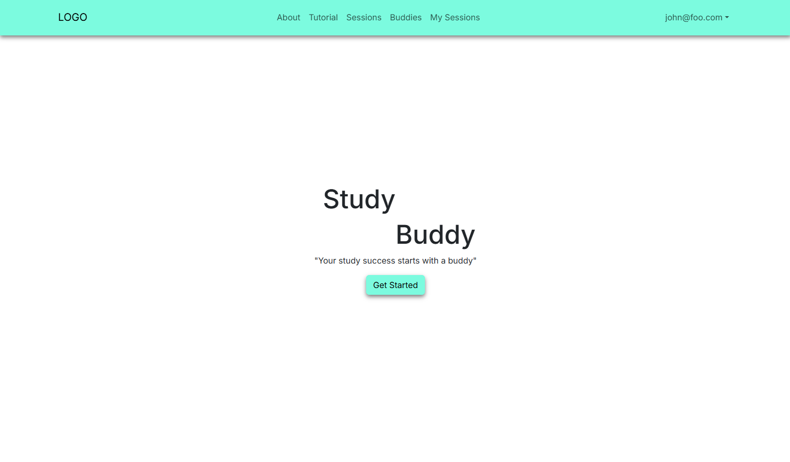
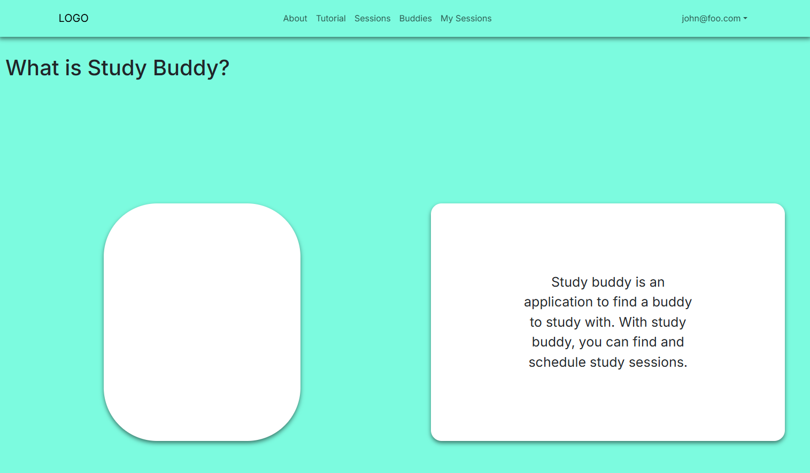
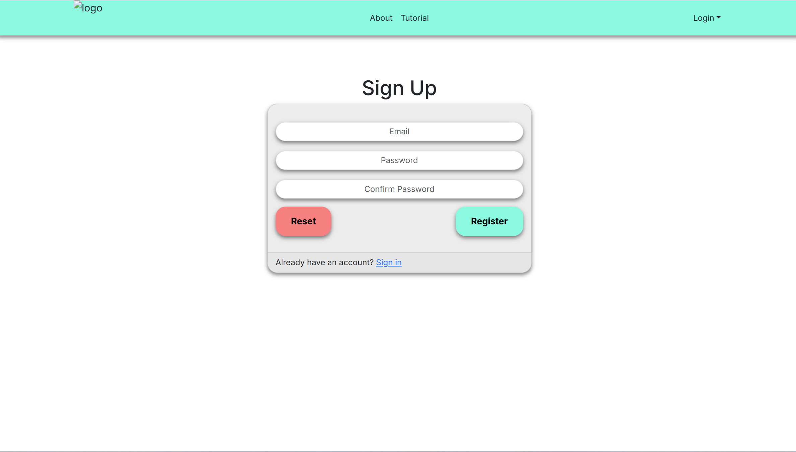
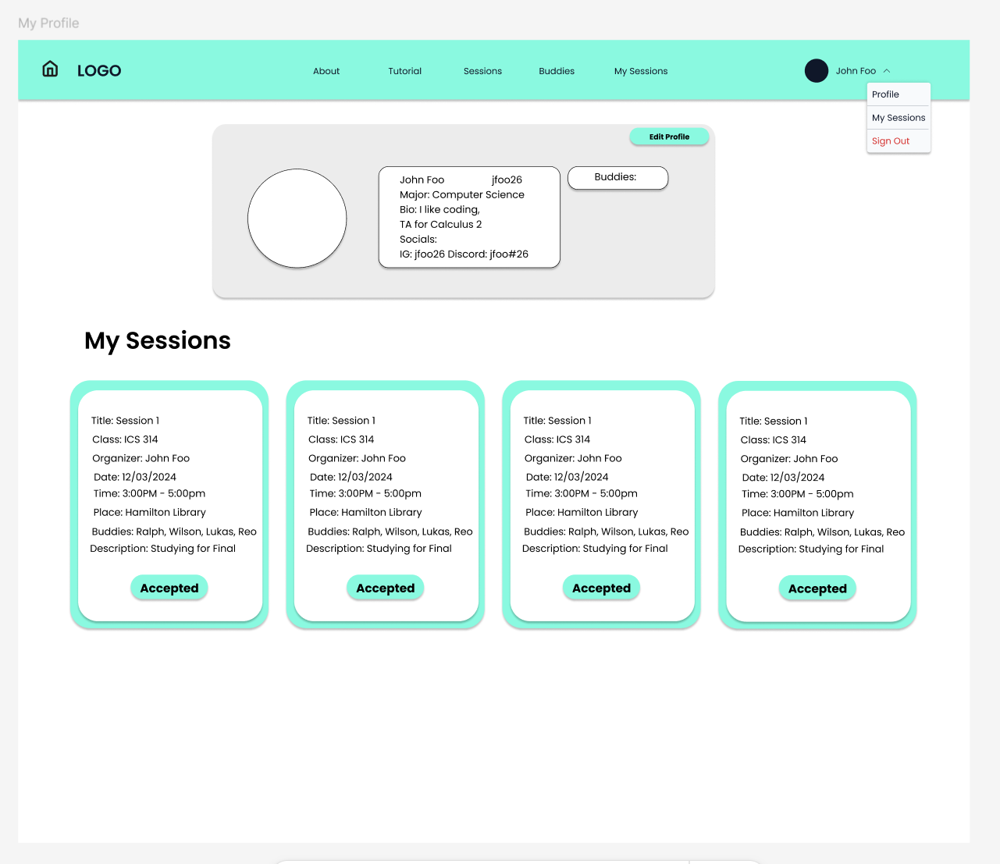
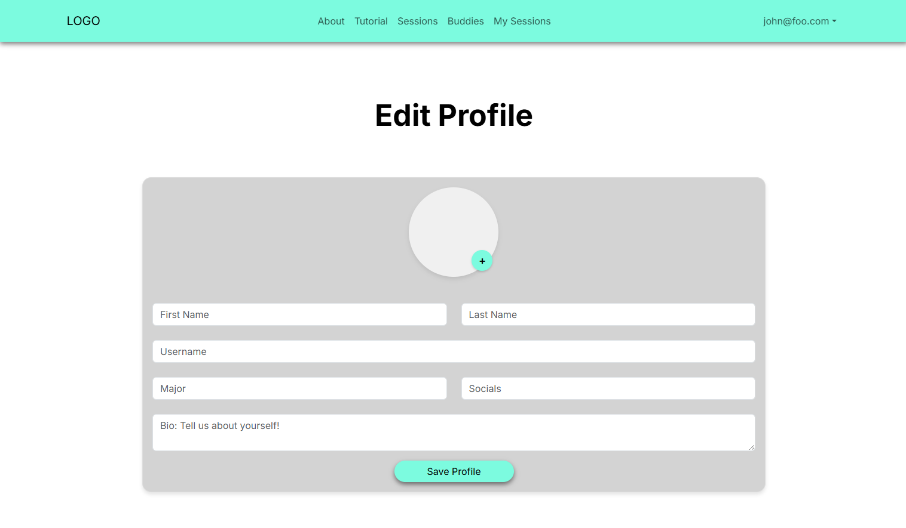
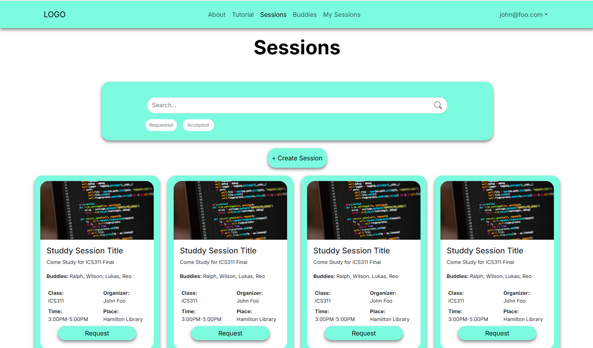
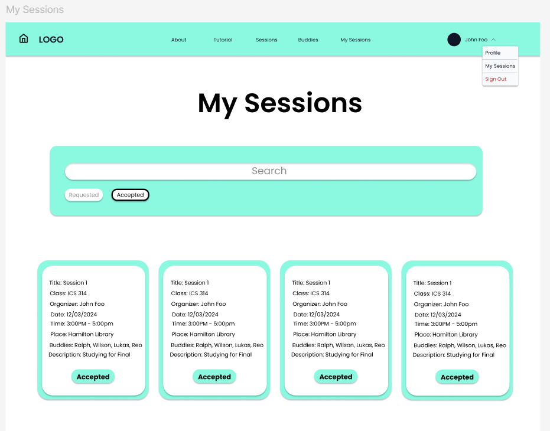
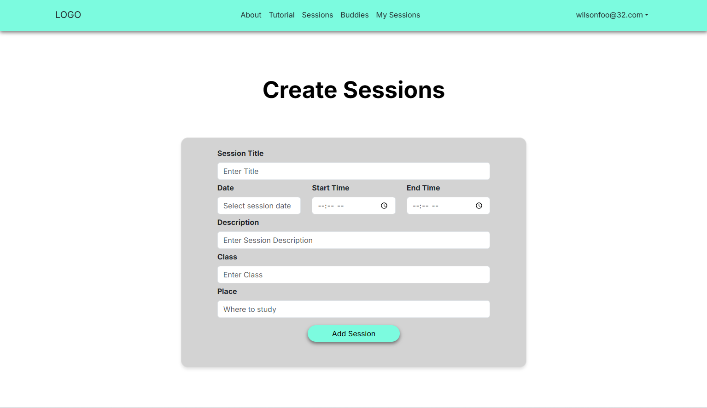
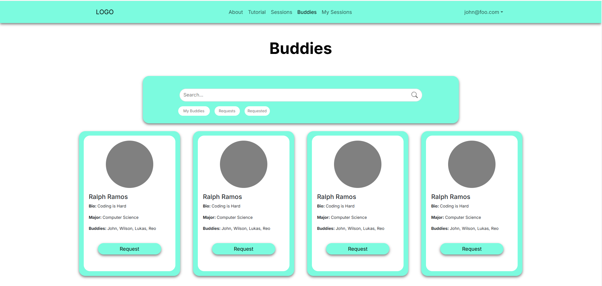

# Study Buddy

## Overview

UHM Study is a web application for students to find study buddies online. It allows users to connect and schedule study sessions. The goal of this project is to solve students' issues with not having someone to study with. This project aims to increase student productivity and network.

* [Contract](https://docs.google.com/document/d/1CuqpTS5TcGMRY66bBHws0psp6xEzRiAeooaWMurNlUc/edit?usp=sharing) 

* [React](https://reactjs.org/) for component-based UI implementation and routing.
* [React Bootstrap](https://react-bootstrap.github.io/) CSS Framework for UI design.

## Home Page

The home page provides an overview of the application features, including multiple users, contact details, and timestamped notes.

## About Page

A brief overview of Study Buddy and its uses

## Sign Up Page

The sign-up page allows users to log in to their accounts. Users need to provide their email and password to sign in.

## My Profile Page

This page features your account information as well as study session the person has committed to.  The profile includes name, major, bio, and socials. The session will include a title, class, creator, date and time, place, collaborators, and a description

## Edit Profile Page

Edit the fields of your profile page like name, bio, social, major, etc

## Sessions

List of available study sessions to join with description of when, where, who, and what

## My Sessions Page

Page to see what study session you have joined with all the information about the session

## Create Sessions

Page to create the study session describing What, When, and Where to study

## Buddies

Page to show the list of buddies you can find, add, and filter which buddies you added.

## Buddy Profile

This page shows the list of all contacts as Admin view.

## Team
Team Members:

- Ralph Ramos
- Wilson Huynh
- Lukas Moroz
- Reo Nagahama

## Team Contract
- Team Contract [https://docs.google.com/document/d/1CuqpTS5TcGMRY66bBHws0psp6xEzRiAeooaWMurNlUc/edit?tab=t.0]

