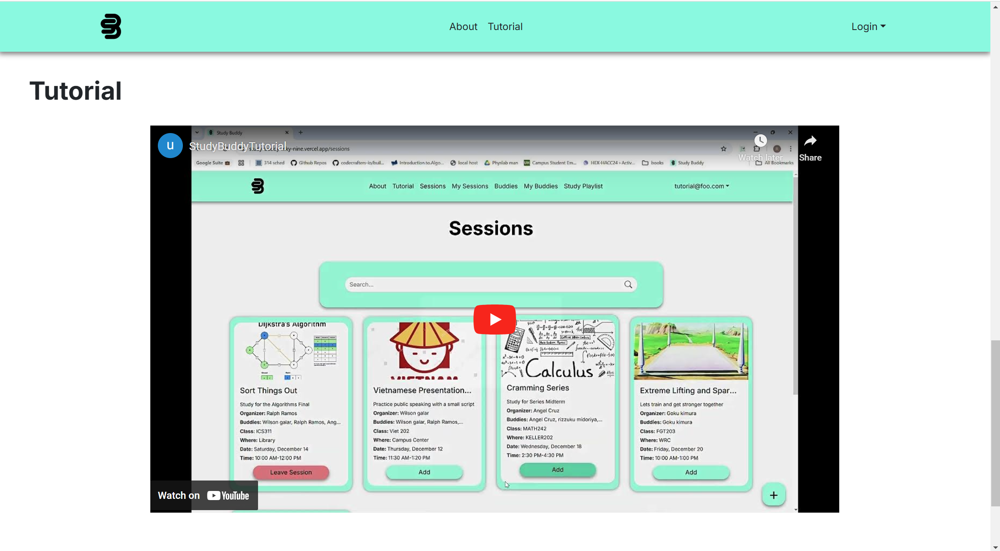
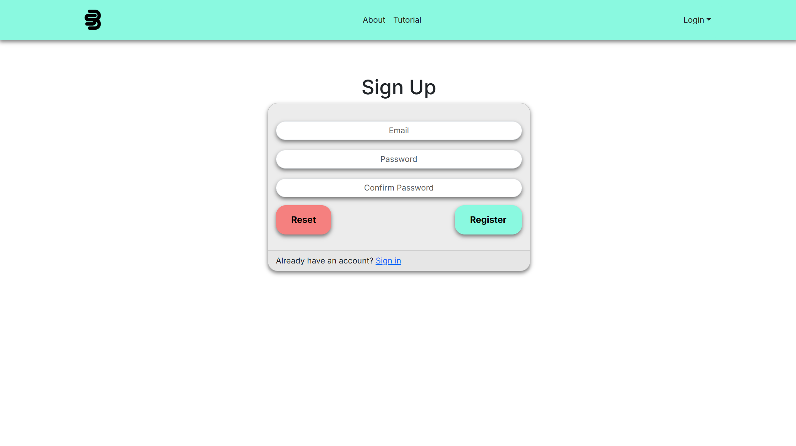
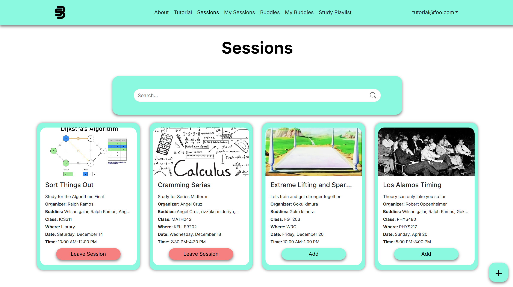

# Study Buddy

## Overview

UHM Study is a web application for students to find study buddies online. It allows users to connect and schedule study sessions. The goal of this project is to solve students' issues with not having someone to study with. This project aims to increase student productivity and network.

* [React](https://reactjs.org/) for component-based UI implementation and routing.
* [React Bootstrap](https://react-bootstrap.github.io/) CSS Framework for UI design.

## User guide

### Home Page

The home page provides an overview of the application features, including multiple users, contact details, and timestamped notes.

### About Page

About Page provides a brief overview of Study Buddy and its uses

### Tutorial

The Tutorial Page offers a video demo of how to use Study Buddy

### Sign Up Page

The sign-up page allows users to create an account. Users need to provide their email and password to sign in.

### Sign In Page

The sign-in page allows users to log in to their accounts. Users need to provide their email and password to sign in.

### Create Profile Page

Create a profile by adding the fields of your profile page like name, bio, social, major, etc allowing people to connect with specific people who take the same classes

### My Profile Page

This page features your account information. The profile includes name, major, bio, and socials. The session will include a title, class, creator, date and time, place, collaborators, and a description
The My Sesions Page will provide study session you have joined with all the information about the session

### Edit Profile Page

Customize and edit the fields of your profile page like name, bio, social, major, etc allowing people to connect with specific people who take the same classes

### Sessions

Provides a list of available study sessions to join with description of when, where, who, and what allowing for easy efficent connections

### Create Sessions

The Create Session Page allows you to create a study session describing What you're studying, where you want to study, and when you want to study in hopes of connecting with others who are studying the same 

### Edit Session

The edit session page allows users to edit the study sessions that they created. You can also delete the session.

### My Sessions

My Sessions page shows all sessions that you added and created

### Edit Session

The edit session page allows users to edit the study sessions that they created

### Buddies

The Buddies Page shows a list of buddies you can find, add, and filter which buddies you added. Similar to a friends list on video games like Brawl Stars

### Buddy Profile

The Buddy Profile Page shows the list of all contacts as Admin view.

## Developer Guide
1. First Clone our github project [repository](https://github.com/uhm-studymax/study-buddy)
2. Open terminal in VScode and type ``npm install``
3. Setup your database using NEON DB POSTGRESQL with VERCEL
    - [Summarized Database Setup Guide](https://docs.google.com/document/d/1aVrZkc9hd2ATA0mQhpRm5HO-mKOJemiUF-Agwj6JGHE/edit?usp=sharing)
    - [ICS 314 Deployment Module](https://courses.ics.hawaii.edu/ics314f24/modules/deployment/
)
4. Configure your cloud database in AWS
   - Create an AWS account
   - Using S3 service, create a bucket
   - Setup and create IAM user
   - Create access keys then transfer those values to your into .env file
   - Configure IAM user policies to allow for S3 bucket permissions along with CORS setup
5. Run your project
   - Go into terminal on VScode, type: ``npm run dev``
   - The site should then be running on [https://localhost:3000](https://localhost:3000)

## Community Feedback

- Brain Shu
  
 Overall, The Study Buddy project is a good practical solution for organizing study sessions. It has a clear purpose and user-friendly design that caters to students' needs. To enhance the platform, consider making it responsive for different platforms such as mobile devices. adding notifications or reminders, and file-sharing tools, to boost productivity.

- Ryan Kamakawiwo’ole
  
The concept of being able to study with people you choose is great. But it was a bit hard navigating through the website on Mobile, that’s the only caveat in terms of accessibility.

- Kevin Martinez
  
Study Buddy has a simple design and layout, making the site easy to understand and use. Everything is accessible and functional, the hyperlinks work as intended, and the website keeps login, however there are some nit-picky things I’ve found. The website is a good idea, easy to use, and has the basic functions that support its concept.

- Katie Huynh
  
 The website was easy to navigate and user friendly. I had no trouble creating a new study session. The website has a simple design consisting mainly of two colors, however, I would incorporate a few more design elements in order to make the website more unique and interesting.

-we need one more

The website received generally positive feedback, with many users appreciating its simplicity, ease of use, and clean design. However, a common issue noted by several users was that the site is not optimized for mobile devices.
  
## Team
Team Members:

- Ralph Ramos
- Wilson Huynh
- Lukas Moroz
- Reo Nagahama

## Team Contract
- [Team Contract](https://docs.google.com/document/d/1CuqpTS5TcGMRY66bBHws0psp6xEzRiAeooaWMurNlUc/edit?tab=t.0)

## Organization Page:
 - [Organization Page](https://github.com/uhm-studymax)

## Milestone 1:
The goal of Milestone 1 was to create a set of HTML pages providing a mockup of the pages in the system.

Milestone 1 was managed using [M1](https://github.com/orgs/uhm-studymax/projects/1)

## Milestone 2:
The goal of Milestone 2 was to implement the data model: the underlying set of Mongo Collections and the operations upon them that would support the BowFolio application.

Milestone 2 was managed using [M2](https://github.com/orgs/uhm-studymax/projects/4/views/1)

   
## Milestone 3:
The goal of Milestone 3 was to clean up the code base and fix minor UI issues.

Milestone 3 was managed using [M3](https://github.com/orgs/uhm-studymax/projects/7/views/1)

## Deployment:
Current live [link](https://study-buddy-inky-nine.vercel.app/) for the project

